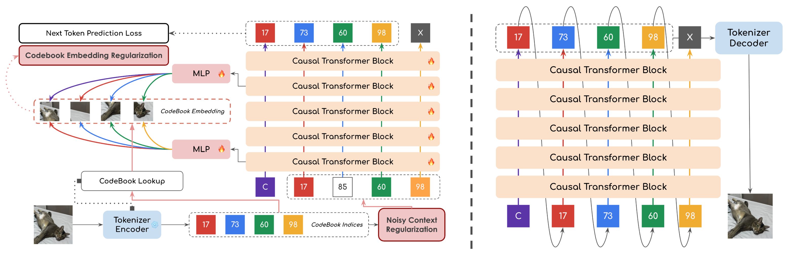

<div align="center">
<h1>reAR: Rethink Visual Autoregressive Generation via Generator-Tokenizer Consistency Regularization</h1>

<div align="center">
<a href=https://arxiv.org/abs/2510.04450 target="_blank"></a>
<a href=https://huggingface.co/qyoo/reAR target="_blank"></a>
<a href=https://qy-h00.github.io/reAR target="_blank"></a>
</div>

<br>

<div align="center">
<div>
  <a href="https://qy-h00.github.io" target="_blank">Qiyuan He</a><sup>1</sup> &nbsp;
  <a target="_blank">Yicong Li</a><sup>1</sup> &nbsp;
  <a target="_blank">Haotian Ye</a><sup>2</sup> &nbsp;
  <a target="_blank">Jinghao Wang</a><sup>3</sup> &nbsp;
  <a target="_blank">Xinyao Liao</a><sup>1</sup> &nbsp;
  
  <a target="_blank">Pheng-Ann Heng</a><sup>3</sup> &nbsp;
  <a target="_blank">Stefano Ermon</a><sup>2</sup> &nbsp;
  <a target="_blank">James Zhou</a><sup>2</sup> &nbsp;
  <a href="https://www.comp.nus.edu.sg/~ayao//" target="_blank">Angela Yao</a><sup>1</sup>
  </sup></a>
  <br>
</div>
<div>
  <sup>1</sup>National University of Singapore &nbsp;
  <sup>2</sup>Stanford University &nbsp;
  <sup>3</sup>The Chinese University of Hong Kong
</div>
</br>
</div>

<p align="center">
  
</p>

<p align="left">
<strong>Overview</strong>: We propose reAR, a simple regularization method that fixes generator-tokenizer inconsistency in visual autoregressive models, i.e, let the AR model generates tokens that is more friendly for the decoder of visual tokenizer. Without altering tokenization and inference, reAR boosts AR on vanilla VQGAN to 1.86 (461M) and AliTok to 1.42 (177M).
</p>
</div>


## 🚀 Quick Start

### 1. Environment Setup

```bash
# Create conda environment
conda create -n rear python=3.10
conda activate rear

# Install dependencies
pip install -r requirements.txt
```

### 2. Project Structure

Set up your project directory as follows:

```
re-ar/
├── configs/                    # Configuration files
├── dataset/                    # Dataset directory
│   ├── pretokenized/          # Pre-tokenized data (recommended)
│   │   └── maskgitvq.jsonl   # Download from HuggingFace
│   └── imagenet_shard/        # Original ImageNet (optional)
│       ├── train/
│       │   ├── imagenet-train-0000.tar
│       │   ├── imagenet-train-0001.tar
│       │   └── ...
│       └── val/
│           ├── imagenet-val-0000.tar
│           ├── imagenet-val-0001.tar
│           └── ...
├── ckpt/                      # Model checkpoints
│   └── maskgitvq.bin         # Download from HuggingFace
└── scripts_bash/             # Training and evaluation scripts
```

### 3. Data Preparation

#### Option A: Pre-tokenized Data (Recommended)
Download the pre-tokenized files for faster training:
```bash
# Download pre-tokenized data
wget https://huggingface.co/yucornetto/RAR/resolve/main/maskgitvq.jsonl -O dataset/pretokenized/maskgitvq.jsonl
```

#### Option B: Original ImageNet
For original ImageNet in webdataset format, follow the [TiTok instructions](https://github.com/bytedance/1d-tokenizer/blob/main/README_TiTok.md).

### 4. Model Checkpoints

Download the MaskGiT-VQGAN tokenizer:
```bash
# Download tokenizer checkpoint
wget https://huggingface.co/fun-research/TiTok/resolve/main/maskgit-vqgan-imagenet-f16-256.bin -O ckpt/maskgitvq.bin
```

Alternatively, for direct evaluation, the following checkpoints are available:

| Model   | Checkpoints |
|---------|-------------------------|
| reAR-S  | [reAR-S.safetensors](https://huggingface.co/qyoo/reAR/blob/main/reAR-S.safetensors) |
| reAR-B  | [reAR-B.safetensors](https://huggingface.co/qyoo/reAR/blob/main/reAR-B.safetensors) |
| reAR-L  | [reAR-L.safetensors](https://huggingface.co/qyoo/reAR/blob/main/reAR-L.safetensors) |


## 🏋️ Training

### Single Command Training

```bash
bash scripts_bash/rear_train.sh
```

### Manual Training Setup

If you prefer to run training manually, here's the complete setup:

```bash
# Navigate to project directory
cd ~/re-ar

# Activate environment
source ~/.bashrc
eval "$(conda shell.bash hook)"
conda activate rear

# Set environment variables
export PYTHONPATH=$(pwd)
export WANDB_INIT_TIMEOUT=300

# Configure training parameters
entity="your_wandb_entity"  # Replace with your Weights & Biases entity
config_name='rear_l'

# Launch training
accelerate launch \
    --num_machines=1 --num_processes=8 --machine_rank=0 \
    --main_process_ip=127.0.0.1 --main_process_port=9999 --same_network \
    scripts/train_rear.py config="configs/${config_name}.yaml" \
    experiment.entity="${entity}" \
    experiment.output_dir="temp/${config_name}"
```

## 📊 Evaluation

### Setup ADM Evaluation

```bash
# Clone ADM evaluation repository
git clone https://github.com/openai/guided-diffusion.git

# Download reference batches
wget https://openaipublic.blob.core.windows.net/diffusion/jul-2021/ref_batches/imagenet/256/VIRTUAL_imagenet256_labeled.npz
```

### Run Evaluation

```bash
# Quick evaluation
bash scripts_bash/rear_test.sh
```

### Manual Evaluation

```bash
# Navigate to project directory
cd ~/re-ar

# Activate environment
source ~/.bashrc
eval "$(conda shell.bash hook)"
conda activate rear

# Set environment variables
export PYTHONPATH=$(pwd)
export WANDB_INIT_TIMEOUT=300

# Configure evaluation parameters
config_name="rear_l"  # Change to your config
output_dir="${config_name}"
checkpoint_path="path/to/your/checkpoint"  # Specify your checkpoint path

# Generate samples
torchrun --nnodes=1 --nproc_per_node=8 --rdzv-endpoint=localhost:19999 \
    scripts/sample_imagenet_rear.py config="configs/training/generator/${config_name}.yaml" \
    experiment.output_dir="${output_dir}" \
    experiment.generator_checkpoint="${checkpoint_path}"

# Evaluate samples
python3 guided-diffusion/evaluations/evaluator.py \
    VIRTUAL_imagenet256_labeled.npz ${output_dir}.npz
```

## 🙏 Acknowledgments

We thank the following projects for their excellent work:
- [RAR](https://github.com/bytedance/1d-tokenizer/blob/main/README_RAR.md): Randomized Autoregressive Visual Generation
- [TiTok](https://github.com/bytedance/1d-tokenizer/blob/main/README_TiTok.md): An Image is Worth 32 Tokens for Reconstruction and Generation
- [MaskBit](https://github.com/markweberdev/maskbit/tree/main): Embedding-free Image Generation via Bit Tokens
- [REPA](https://github.com/sihyun-yu/REPA/tree/main): Representation Alignment for Generation:
Training Diffusion Transformers Is Easier Than You Think
- [AliTok](https://github.com/ali-vilab/alitok): Towards Sequence Modeling Alignment between Tokenizer and Autoregressive Model

